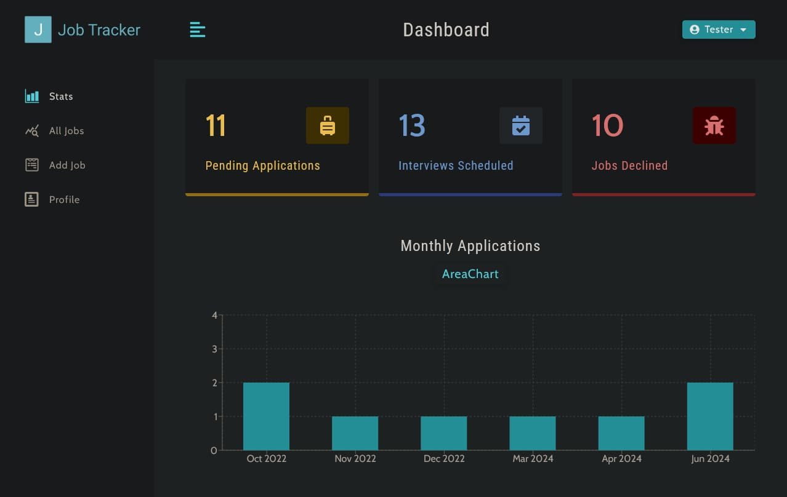
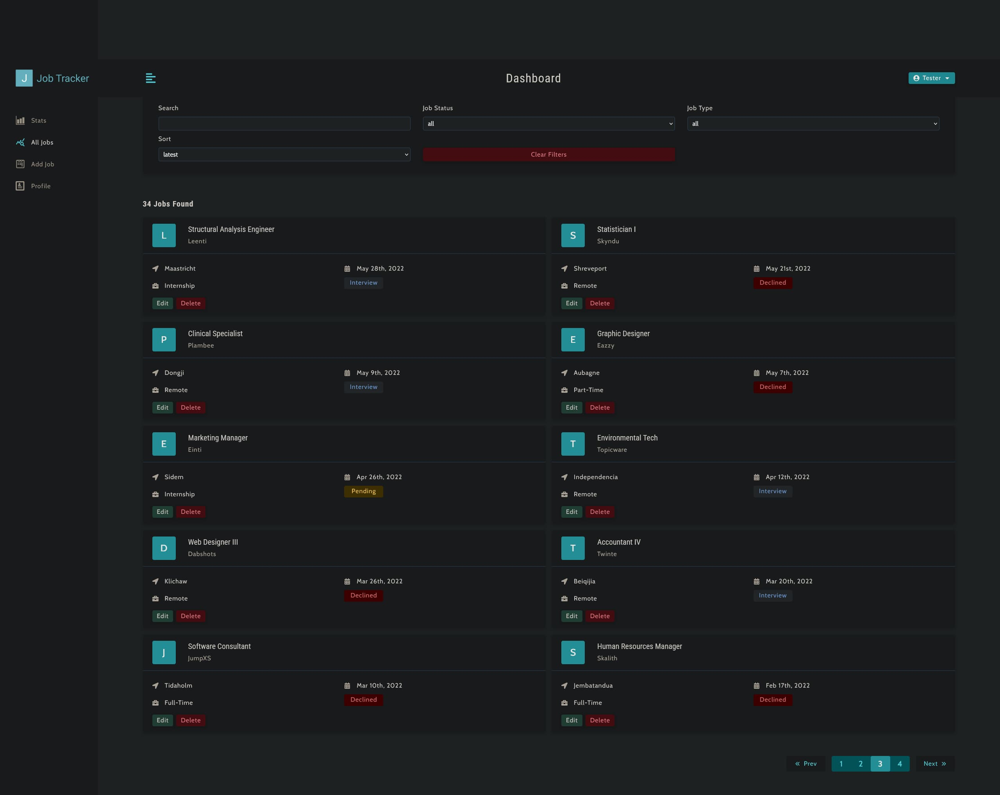
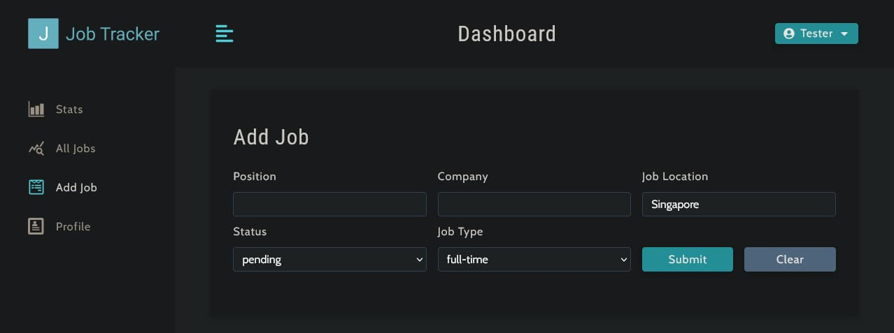
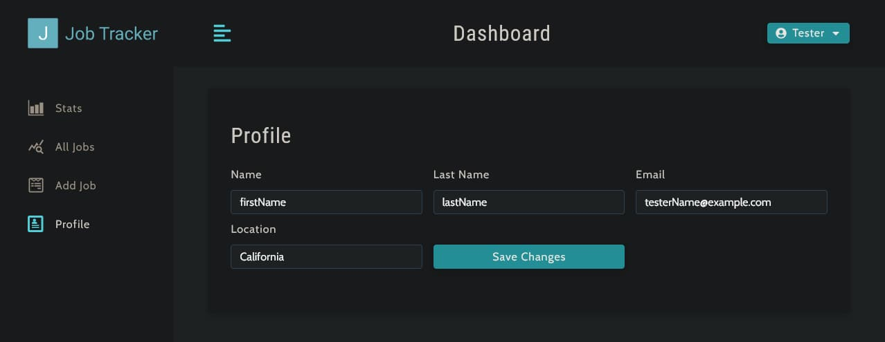

# PlacementPilot (job tracker) 🚀


Job tracker is a full-stack MERN web application designed to help students and job seekers efficiently track their job and internship applications in one place.

The platform allows users to manage applications, monitor application status, analyze progress, and organize their placement journey through an intuitive dashboard.

---

## ✨ Features

- 🔐 User Authentication & Authorization
- 📋 Track Job / Internship Applications
- 📊 Dashboard Analytics & Statistics
- 🔎 Search, Filter & Sort Applications
- 🏢 Company-wise Application Management
- 📅 Application Status Tracking
- 📈 Visual Insights using Charts
- ⚡ Responsive Modern UI

---

## 🛠️ Tech Stack

### Frontend
- React.js
- React Router
- Context API
- Axios
- Styled Components
- Recharts

### Backend
- Node.js
- Express.js
- MongoDB
- Mongoose
- JWT Authentication

---

## 📂 Project Structure

```bash
client/         # React frontend
controllers/    # Backend controllers
routes/         # API routes
models/         # MongoDB schemas
middleware/     # Authentication middleware
db/             # Database connection
utils/          # Utility functions
```

---

## 🚀 Getting Started

### 1️⃣ Clone Repository

```bash
git clone https://github.com/YOUR_USERNAME/placement-pilot.git
```

### 2️⃣ Install Dependencies

```bash
npm install
cd client
npm install
```

### 3️⃣ Setup Environment Variables

Create a `.env` file in the root directory.

```env
MONGO_URL=your_mongodb_connection_string
SECRET_KEY=your_secret_key
LIFETIME=1d
PORT=4000
```

### 4️⃣ Run Application

```bash
npm start
```

Frontend:
```bash
http://localhost:3000
```

Backend:
```bash
http://localhost:4000
```

---

## 📸 Future Improvements

- Resume Upload System
- AI-based Job Recommendations
- Interview Scheduling
- Email Notifications
- Dark Mode
- Company Review Section

---

## 🎯 Purpose

This project was built to strengthen full-stack development skills and understand real-world MERN application architecture including authentication, REST APIs, database management, and dashboard analytics.

---

## 👨‍💻 Author

**Gaurav Uniyal**

GitHub:  
https://github.com/Gaurav-U

---

## ⭐ If you like this project

Give it a star on GitHub ⭐

# Preview & Screenshots

### 📊 Job Statistics Overview  
Monitor the status of your job applications. 


### 🔍 Browse & Search Jobs  
View your entire job list with search filters and pagination.


### ➕ Add New Jobs  
Submit job entries quickly using a simple input form.


### 👤 Profile Management  
Update your basic profile information.


